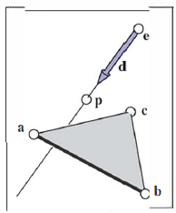

# 光线-物体求交

&emsp;&emsp;一旦我们生成了一条光线\\(\mathbf{e}+t\mathbf{d}\\)，接下来我们要找到当\\(t>0\\)时，第一个与光线相交的物体。实践中，解决一个稍微普遍些的问题是非常有用的：在区间\\([t_{0},t_{1}]\\)内群招光线与表面相交的值\\(t\\)。光线相交的常见情形是\\(t_{0}=0\\)且\\(t_{1}=+\infty\\)。我们分别在表面是球面和三角形的情况下求解这个问题。多重物体将在随后的章节讨论。

## 光线-球面求交

&emsp;&emsp;给定一条光线\\(\mathbf{p}(t)=\mathbf{e}+t\mathbf{d}\\)和一个表面隐式方程\\(f(\mathbf{p})=0\\)（见章节2.7.3），我们想知道他们何处相交。相交点位于光线方程满足表面隐式方程处，因而我们寻找\\(t\\)值的过程就是求解方程：

\\[f(\mathbf{p}(t))=0\quad\mathrm{or}\quad f(\mathbf{e}+t\mathbf{d})=0.\\]

&emsp;&emsp;一个中心为\\(\mathbf{c}\ =\ (x_{c},y_{c},z_{c})\\)，半径为\\(R\\)的球面可以表示为隐式方程：

\\[(x-x_{c})^{2}+(y-y_{c})^{2}+(z-z_{c})^{2}-R^{2}=0.\\]

可以把这个方程写成向量形式：

\\[(\mathbf{p}-\mathbf{c})\cdot(\mathbf{p}-\mathbf{c})-R^{2}=0.\\]

&emsp;&emsp;任意满足方程的点\\(\mathbf{p}\\)位于球面上。如果我们将光线上的点\\(\mathbf{p}(t)=\mathbf{e}+t\mathbf{d}\\)带入方程，我们得到一个以\\(t\\)为未知数的方程，由\\(t\\)值生成的点位于球面上：

\\[(\mathbf{e}+t\mathbf{d}-\mathbf{c})\cdot(\mathbf{e}+t\mathbf{d}-\mathbf{c})-R^{2}=0.\\]

重排各项得到：

\\[({\bf d}\cdot{\bf d})t^{2}+2{\bf d}\cdot({\bf e}-{\bf c})t+({\bf e}-{\bf c})\cdot({\bf e}-{\bf c})-R^{2}=0.\\]

&emsp;&emsp;在这个方程中，除参数\\(t\\)外，所有值是已知的，所以这是一个关于\\(t\\)的经典的二次方程，这意味着方程有这样的结构：

\\[A t^{2}+B t+C=0.\\]

&emsp;&emsp;这种方程的求解在章节2.2中已经被讨论过。位于二次方程解的平方根符号下的项\\(B^{2}-4AC\\)被称为判别式，它告诉我们方程有多少实数解。如果判别式为负，那么平方根是虚值，直线与球面不相交。如果判别式是正的，方程有两个解：一个解是光线进入球面的位置，另一个解是光线离开球面的位置。如果判别式是0，光线与球面相切，两者仅接触于一个点。代入各项到二次方程解的表达式中，同时约去因子2，我们得到：

\\[t={\frac{-\mathbf{d}\cdot(\mathbf{e}-\mathbf{c})\pm{\sqrt{(\mathbf{d}\cdot(\mathbf{e}-\mathbf{c}))^{2}-(\mathbf{d}\cdot\mathbf{d})\cdot((\mathbf{e}-\mathbf{c})\cdot(\mathbf{e}-\mathbf{c})-R^{2})}}}{(\mathbf{d}\cdot\mathbf{d})}}.\\]

&emsp;&emsp;在实际的实现中，你应该在计算其他各项前先检查判别式的值。要在区间\\([t_{0},t_{1}]\\)内正确找到最近的交点，有三种情况：如果两个解中较小的一个在区间内，则它是第一个命中点；否则，如果较大的解在区间内，则它是第一个命中点；否则，没有命中点。

&emsp;&emsp;正如在章节2.7.4的讨论，点\\(\bf p\\)处的法向量可通过梯度求得\\(\bf n = 2(\bf p - \bf c)\\)。单位法向量是\\((\bf p - \bf c)/R\\)。

## 光线-三角形求交

&emsp;&emsp;有许多计算光线-三角形求交的算法。我们将介绍，在包含三角形的参数平面上使用重心坐标的形式，因为除了三角形的顶点外，不需要其他长期存储（Snyder & Barr, 1987）。

&emsp;&emsp;为了求光线和参数平面的交，我们建立一组笛卡尔坐标值完全满足的方程组：

\\[
    \left.\begin{array}{l l}{x_{e}+t x_{d}=f(u,v)}\\\\ {y_{e}+t y_{d}=g(u,v)}\\\\ {z_{e}+t z_{d}}={h(u,v)}\end{array}\right\rbrace \quad\mathrm{or,} {\bf e}+t{\bf d}={\bf f}(u,v).
\\]

在这组方程中，我们有三个方程和三个未知数（\\(t,u\\)与\\(v\\)）。当表面是参数平面时，参数方程是线性的，能够被写成章节2.9.2讨论的向量形式。如果三角形的顶点是\\(\bf a\\)，\\(\bf b\\)和\\(\bf c\\)，交点出现在某些\\(t,\beta,\gamma\\)，满足：

\\[
{{\mathbf{e}+t\mathbf{d}=\mathbf{a}+\beta(\mathbf{b}-\mathbf{a})+\gamma(\mathbf{c}-\mathbf{a}),}}\qquad\qquad\qquad(4.2)
\\]

求解这个方程将得到\\(t\\)，用来沿光线定位交点；\\((\beta,\gamma)\\)，用来定位相对于三角形的交点。如图4.10示，交点\\(\bf p\\)位于\\({\bf e}+t{\bf d}\\)。



**图4.10：** 光线击中三角形所在平面于点\\(\bf p\\)。

&emsp;&emsp;为了求解方程(4.2)中的\\(t, \beta, \gamma\\)，我们将向量方程的形式展开为三个坐标值的方程的形式：

\\[
\begin{array}{c}{{x_{e}+t x_{d}=x_{a}+\beta(x_{b}-x_{a})+\gamma(x_{c}-x_{a}),}}\\\\ {{y_{e}+t y_{d}=y_{a}+\beta(y_{b}-y_{a})+\gamma(y_{c}-y_{a}),}}\\\\ {{z_{e}+t z_{d}=z_{a}+\beta(z_{b}-z_{a})+\gamma(z_{c}-z_{a}).}}\end{array}
\\]

&emsp;&emsp;可以被重写成一个标准线性系统：

\\[
    \left[
        \begin{array}{c c c}
            {{x_{a}-x_{b}}}&{{x_{a}-x_{c}}}&{{x_{d}}}\\\\ {{y_{a}-y_{b}}}&{{y_{a}-y_{c}}}&{{y_{d}}}\\\\ {{z_{a}-z_{b}}}&{{z_{a}-z_{c}}}&{{z_{d}}}
        \end{array}
    \right]
    \left[
        \begin{array}{c}
        \beta\\\\ \gamma \\\\ t
        \end{array}
    \right]
    =
    \left[
        \begin{array}{c}
        x_{a}-x_{e} \\\\ y_{a}-y_{e} \\\\ z_{a}-z_{e}
        \end{array}
    \right]
\\]

求解\\(3\times 3\\)线性系统最快的经典方法是克莱姆法则。可以直接给出解：
\\[
\beta = \frac{\left|\begin{array}{c c c}x_a-x_e&x_a-x_c&x_d\\\\ y_a-y_e&y_a-y_c&y_d\\\\ z_a-z_e&z_a-z_c&z_d \end{array}\right|}{\left|\mathbf{A}\right|},
\\]

\\[
\gamma = \frac{\left|\begin{array}{c c c}x_a-x_b&x_a-x_e&x_d\\\\ y_a-y_b&y_a-y_e&y_d\\\\ z_a-z_b&z_a-z_e&z_d \end{array}\right|}{\left|\mathbf{A}\right|},
\\]

\\[
t = \frac{\left|\begin{array}{c c c}x_a-x_b&x_a-x_c&x_a-x_e\\\\ y_a-y_b&y_a-y_c&y_a-y_e\\\\ z_a-z_b&z_a-z_c&z_a-z_e \end{array}\right|}{\left|\mathbf{A}\right|}
\\]

矩阵\\(\bf A\\)是：

\\[\mathbf{A}=\left[\begin{array}{c c c}{x_{a}-x_{b}}&{x_{a}-x_{c}}&{x_{d}}\\\\ {y_{a}-y_{b}}&{y_{a}-y_{c}}&{y_{d}}\\\\ {z_{a}-z_{b}}&{z_{a}-z_{c}}&{z_{d}}\end{array}\right]\\]

\\(\left|{\bf A}\right|\\)是\\(\bf A\\)的行列式。\\(3\times 3\\)行列式有公共子项，可以用来实现高效算法。对于使用虚拟变量的线性系统：
\\[
\left[
    \begin{array}{c c c}
    a&d&g\\\\ b&e&h\\\\ c&f&i
    \end{array}
\right]
\left[
    \begin{array}{c}
    \beta\\\\ \gamma\\\\ t
    \end{array}
\right]=
\left[
    \begin{array}{c}
    j\\\\ k\\\\ l
    \end{array}
\right]
\\]

克莱姆法则给出：

\\[
    \beta=\frac{j(ei-hf)+k(gf-di)+l(dh-eg)}{M}
\\]

\\[
    \gamma=\frac{i(ak-jb)+h(jc-al)+g(bl-kc)}{M}
\\]

\\[
    t=-\frac{f(ak-jb)+e(jc-al)+d(bl-kc)}{M}
\\]

其中：

\\[
    M=a(ei-hf)+b(gf-di)+c(dh-eg)
\\]

我们可以简化操作数的数量，通过重用部分值（例如\\(ei-hf\\)）。

&emsp;&emsp;我们需要的线性解，在光线-三角求交算法中可以有一些提前终止条件。因此，函数看起来是：

```
boolean raytri(Ray r, vector3 a, vector3 b, vector3 c, intrval[t_0,t_1])
compute t
if (t < t_0) or (t > t_1) then
    return false
compute gamma
if (gamma < 0) or (gamma > 1) then
    return false
compute beta
if (beta < 0) or (beta > 1 - gamma) then
    return false
return true
```

## 软件中的光线求交

&emsp;&emsp;在光线追踪程序中，使用面向对象设计是一个好想法，它有一个类似*Surface*的类以及派生类*Triangle*，*Sphere*等等。一个光线可以相交的任何东西，包括表面组或者章节12.3描述的高效结构，都应是*Surface*的子类。这样，光线追踪程序就只需引用整个模型的一个曲面，就可以透明地添加新的对象类型和高效结构。

&emsp;&emsp;Surface类的关键接口时一个求与光线相交的方法（Kirk & Arvo, 1988）：

```
class Surface
    HitRecord hit(Ray r, real t_0, real t_1)
```

这里，\\((t_0,t_1)\\)时将被返回的击中点在光线上的区间，HitRecord时一个包含所有表面相交所需要的数据的类：

```
class HitRecord
    Surface s | surface tha was hit
    real t | coordinate of hit point along the ray
    Vec3 n | surface normal at the hit point
    .
    .
    .
```

击中的表面、\\(t\\)值、表面法向是类的最小要求，其他数据例如纹理坐标或者切向量也可以被存储在这个类中。根据语言的不同，命中记录可能不会从函数中直接返回，而是通过引用传递并填充进去。\\(t=\infty\\)的命中可以表示未命中。

## 一组物体求交

&emsp;&emsp;当然，大多感兴趣的场景包含超过一个物体，当我们求交光线与场景时，我们必须找到沿光线方向最接近相机的相交。实现这一点的简单方法是，将一组对象视为另一种类型的对象。要使光线与组相交，只需将光线与组中的对象相交，然后返回\\(t\\)值最小的交点。下列代码测试了在区间\\(t\in [t_0,t_1]\\)的命中：

```
class Group, subclass of Surface
    list-of-Surface surfaces | list of all surfaces in the group
    HitRecord hit(Ray ray, real t_0, real t_1)
        HitRecord closest-hit(infinity) | initialize to indicate miss
        for surf in surfaces do
            rec = surf.hit(ray, t_0, t_1)
            if rec.t < infinity then
                closest-hit = rec
                t_1 = t
        return closet-hit
```

注意，这段代码迭代缩小求交区间\\([t_0, t_1]\\)，因此surf.hit的调用只会命中看起来越来越接近的平面。

&emsp;&emsp;一旦光线-场景求交代码工作后，我们能够渲染一张如图4.11所示的图片，然而更愉快的结果依赖更多的视觉相关线索，我们将在下文介绍。


**图4.11：** 一个只有光线生成和表面相交，没有着色的的场景渲染；每个像素被直接填充成光线命中的物体的固定颜色。